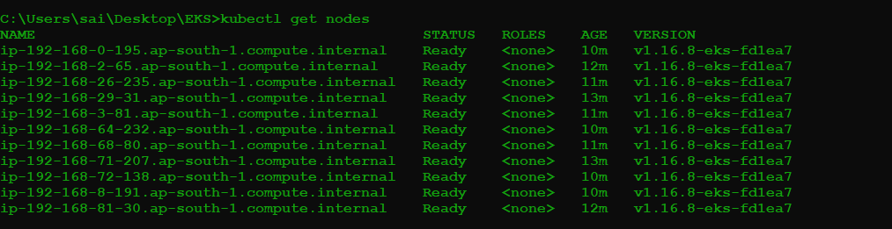
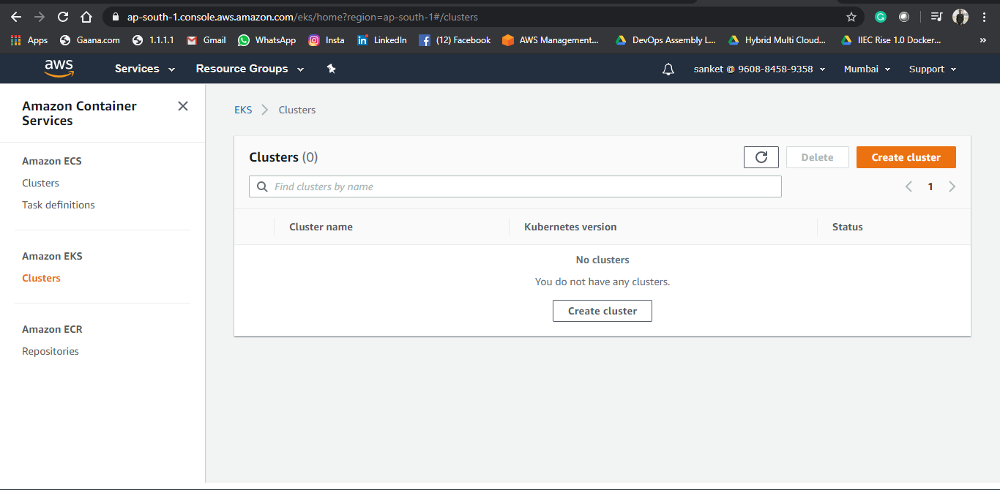
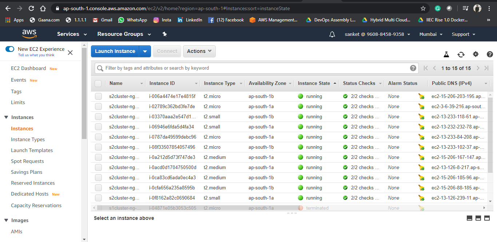
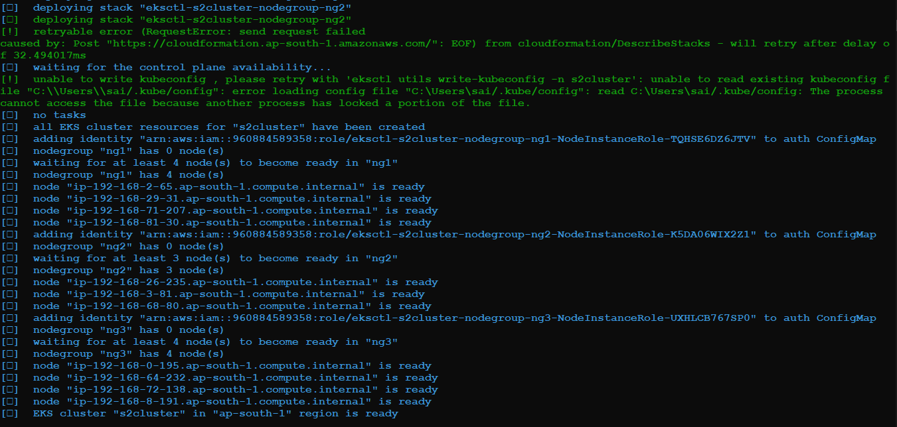
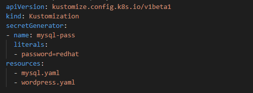
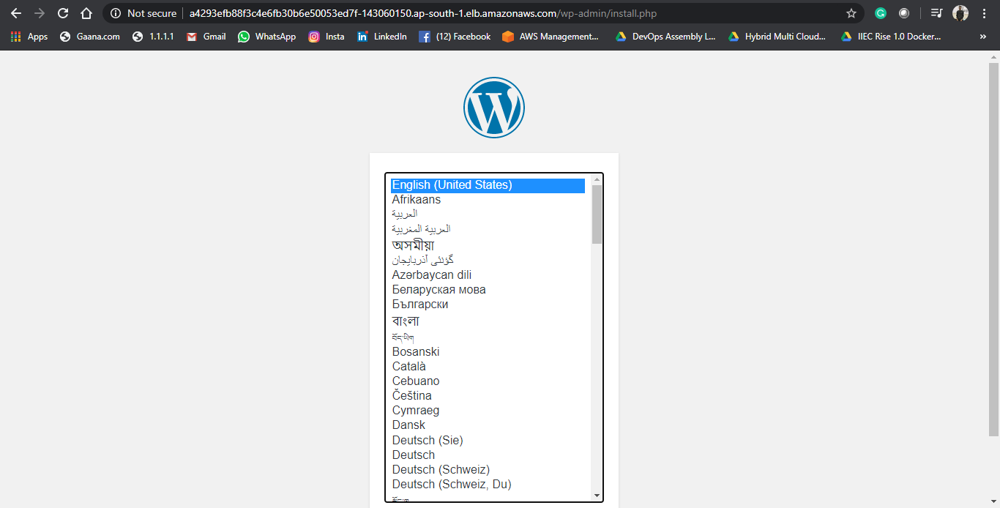
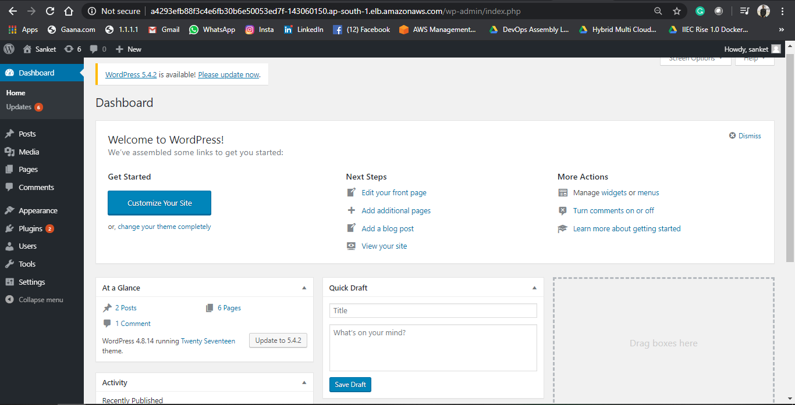
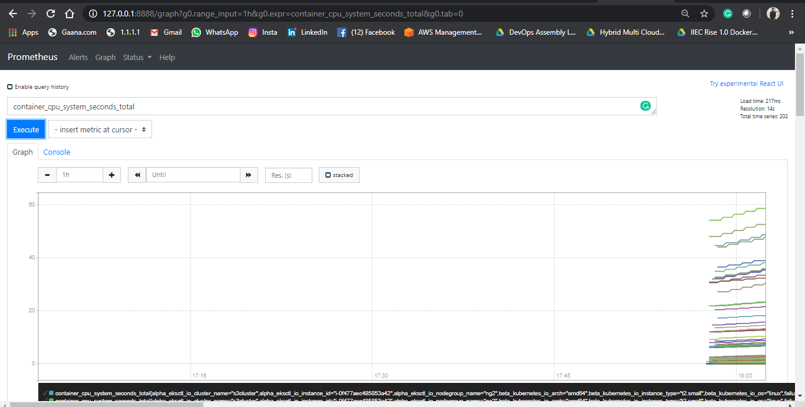
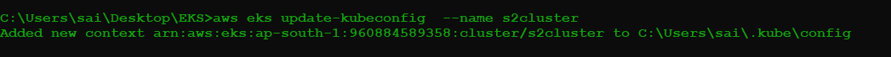

# 🌩️ EKS Cluster with WordPress & MySQL on AWS

This repository contains `eksctl` and Kubernetes YAML manifests to create an **Amazon EKS cluster** and deploy a **WordPress frontend** with a **MySQL backend**.  
The `images/` folder has AWS Console and `kubectl` output screenshots for each major step so you can visually verify the infrastructure.

---

## 🧱 Infrastructure Components

#### EKS Cluster Configuration

The core EKS cluster is defined in `cluster.yml` and deployed to the `ap-south-1` region.

| Parameter | Value |
| :--- | :--- |
| Cluster Name | `s2cluster` |
| AWS Region | `ap-south-1` |
| Kubernetes Version | `1.16` |
| Control Plane | Public Access |

#### EKS Node Group Configuration

The cluster is provisioned with three distinct node groups, each using a different EC2 instance size to accommodate various workloads.

| Node Group | Instance Type | Desired Capacity | Min Size | Max Size |
| :--- | :--- | :--- | :--- | :--- |
| `ng1` | `t2.micro` | 4 | 4 | 4 |
| `ng2` | `t2.small` | 3 | 3 | 3 |
| `ng3` | `t2.medium` | 4 | 4 | 4 |

### Kubernetes Workloads

The `kustomization.yml` file orchestrates the deployment of all necessary Kubernetes objects:

*   **MySQL (Backend):**
    *   `Secret`: A `mysql-pass` secret is dynamically generated by Kustomize to securely store the `MYSQL_ROOT_PASSWORD`.
    *   `Deployment`: Manages the MySQL pod.
    *   `Service`: A `ClusterIP` service named `wordpress-mysql` on port 3306, allowing internal cluster communication.
    *   `PersistentVolumeClaim`: A 10Gi PVC (`mysql-pvc`) to ensure the database's data is persistent.

*   **WordPress (Frontend):**
    *   `Deployment`: Manages the WordPress pods.
    *   `Service`: A `LoadBalancer` service named `wordpress` on port 80. AWS will automatically provision an Elastic Load Balancer to expose this service to the internet.
    *   `PersistentVolumeClaim`: A 10Gi PVC (`wp-pvc`) to store the WordPress content (themes, plugins, uploads).
This repo is a simple but complete example of running a **stateful application (WordPress + MySQL)** on **Amazon EKS** using declarative configs.

---

## 🧰 Prerequisites

- AWS account with permissions to create:
  - EKS cluster, node groups, EC2 instances, networking resources, and load balancers
- Tools installed:
  - `awscli`
  - `eksctl`
  - `kubectl`
- (Optional) Kustomize support (built into recent `kubectl` via `kubectl apply -k`)
- AWS credentials configured:
  - `aws configure`, or  
  - environment variables, or  
  - named AWS profile

---

## 🚀 How to use

### 1) Clone the repository

```bash
git clone https://github.com/sanket3122/EKS-TASK.git
cd EKS-TASK
```

2) Configure AWS credentials
```bash
aws configure
```
Or set the environment variables:
```
export AWS_ACCESS_KEY_ID=YOUR_KEY
export AWS_SECRET_ACCESS_KEY=YOUR_SECRET
export AWS_DEFAULT_REGION=ap-south-1
```

3) Create the EKS cluster with node groups
```
eksctl create cluster -f cluster.yml
```

4) Verify the cluster and nodes
```
kubectl get nodes
kubectl get ns
```

5) Deploy MySQL and WordPress using Kustomize
```
kubectl apply -k .
# or, individually:
# kubectl apply -f mysql.yaml
# kubectl apply -f wordpress.yaml
```

6) Check pods and services
```
kubectl get pods
kubectl get svc
```

7) Get the external LoadBalancer endpoint for WordPress:
```
kubectl get svc wordpress -o wide
```

Open the external hostname/IP in a browser to access the WordPress site.

Destroy resources when finished
```
kubectl delete -k .
# or:
# kubectl delete -f wordpress.yaml -f mysql.yaml

eksctl delete cluster -f cluster.yml
# or:
# eksctl delete cluster --name s3cluster --region ap-south-1
```

## Files

`cluster.yml` – eksctl config for the EKS cluster and node groups
`kustomization.yml` – Kustomize config to generate the MySQL secret and apply resources
`mysql.yaml` – Kubernetes Service, PVC, and Deployment for the MySQL backend
`wordpress.yaml` – Kubernetes Service, PVC, and Deployment for the WordPress frontend

images/ – All AWS Console and kubectl screenshots referenced below

## 📸 Screenshot Details

### 1️⃣ EKS worker nodes are Ready
`kubectl get nodes` output showing all worker nodes in the EKS cluster in **Ready** state.


### 2️⃣ EKS cluster in AWS console
AWS EKS console showing the **s3cluster** / **s2cluster** running in `ap-south-1`.


### 3️⃣ Cluster list view
AWS EKS console listing clusters and their Kubernetes version and status.


### 4️⃣ EC2 instances for node groups
EC2 console showing all worker node instances created for node groups `ng1`, `ng2`, and `ng3`.


### 5️⃣ eksctl create cluster output
`eksctl` CLI output confirming control plane creation, nodegroups becoming ready, and the cluster status as ready.


### 6️⃣ Kustomize config
`kustomization.yml` definition that generates the `mysql-pass` secret and applies `mysql.yaml` and `wordpress.yaml`.


### 7️⃣ WordPress install page
Public LoadBalancer URL opening the initial WordPress **language selection / install** screen.


### 8️⃣ WordPress admin dashboard
WordPress **wp-admin** dashboard after successful install, backed by MySQL running inside the EKS cluster.


### 9️⃣ Prometheus metrics
Prometheus UI graphing container CPU metrics for workloads running on the EKS cluster.


### 🔟 Cluster cleanup
AWS EKS console showing **no clusters**, confirming the EKS cluster was deleted successfully.


Thank you!


